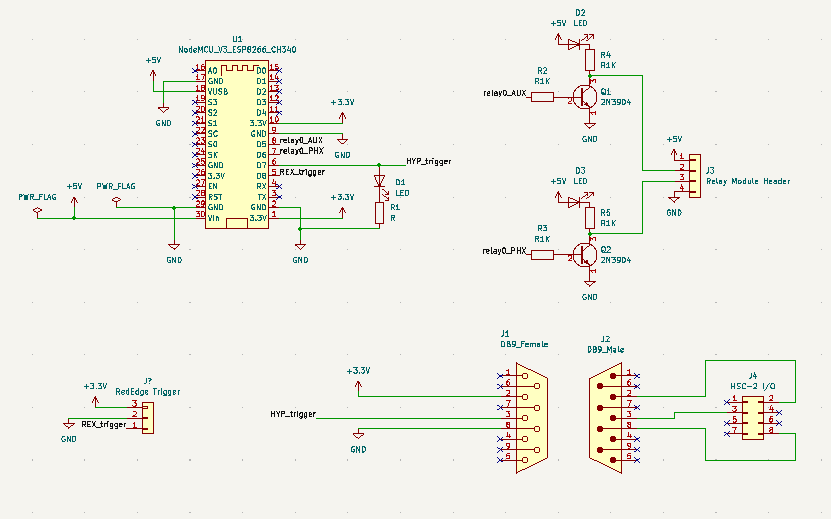
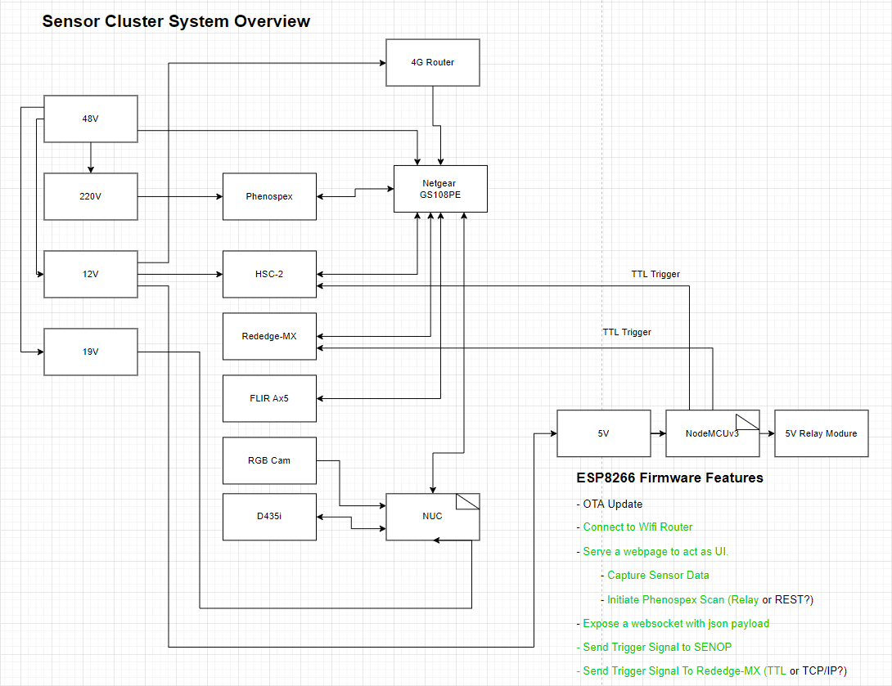

# ESP8266 Based Data Capture Trigger

### Rob Lloyd, University of Lincoln, UK. 31/3/22.

## Introduction

This is the repository associated with a device to trigger multiple optical sensors simultaneously by deploying a web interface. This version provides simple TTL level output to the numerous sensors. These TTL signals instruct the sensors to capture and store the data with onboard storage, to be retrieved at the end of the data collection session.

## Usage

While connected to the 'PhenoNet' wifi network associated with the UoL Phenotyping platform, connect to the address:

    192.168.1.104

This can be done with a web browser on port 80. You will be presented with the simple interface. Pushing any of the buttors will trigger a capture on that device. Alternatively, you can elect to 'Capture All' devices. 

---
## Hardware Requirements

### BOM:
    ESP8266 Development Module
    5V Relay module
    2x 2N3904 NPN Transistors
    4x 1kOhm resistor
    2x 470Ohm resistor
    4x LED (various colours) 
    Your choice of circuit board or prototyping board.

The core of this project is an esp8266 development board. These can be purchase for ~£5 or more from your favourite seller. The parts list could exclude the NPN transistors if you use a relay module that accepts 3.3V trigger signals.  

A kicad project containing the schematics can be found in the 'Kicad' folder

## System Overview

At the present time, this device occupies the 'NodeMCUv3' and '5V Relay Module' nodes of the system diagram.

---
## Environment Setup
(If you want to add features)

First off, get everything working in vscode. You need to install the arduino ide and vscode with c++ and arduino extensions.

Follow the instructions to get a basic arduino uploading from vscode.

Then you need to add the esp8266 boards in the arduino board manager

https://randomnerdtutorials.com/how-to-install-esp8266-board-arduino-ide/

The project at this point relies heavily on the following three tutorials:

1) Sample code for create a websocket on an ESP8266 board. 

https://youtu.be/fREqfdCphRA MrDIY.ca

2) Other inspiration, taken from Mo-Thunderz Tutorials on websocket communication on the ESP8266/ESP32

https://github.com/mo-thunderz/Esp32WifiPart2

### Short version

You need these libraries

    #include <Arduino.h>
    #include <ESP8266WiFi.h>
    #include <ESP8266WiFiMulti.h>
    #include <WebSocketsServer.h>
    #include <ESP8266WebServer.h>
    #include <Hash.h>
    #include <ArduinoJson.h>

---

## Future Work

In the future, it would be nice to separate out the html/javascript files. maybe add a wifi manager too. This could reuse code from a previous project

https://github.com/rwlloyd/stupid-linear-actuator#esp8266-http-server-serving-html-javascript-and-css

which in turn, leans heavily on:

https://randomnerdtutorials.com/esp8266-web-server-spiffs-nodemcu/

There are so many ways to flay this particular feline.

